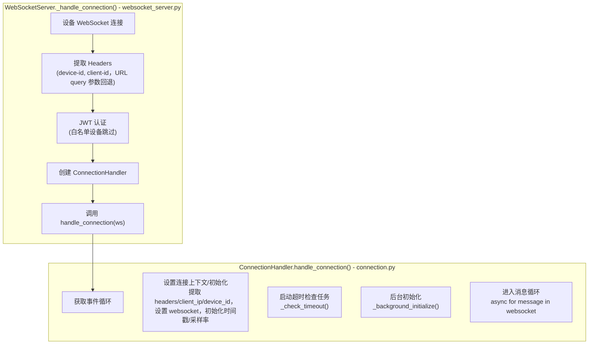
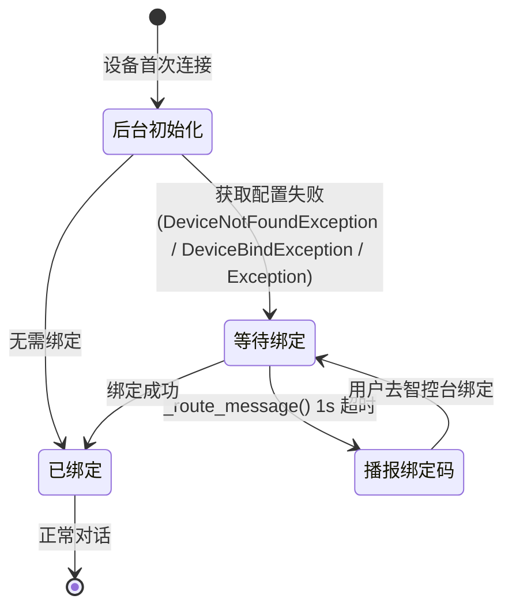
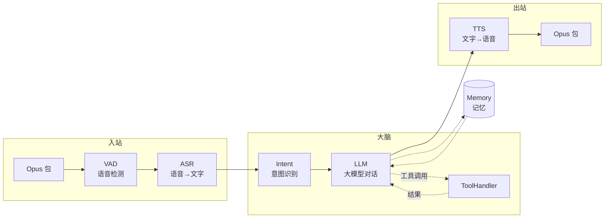
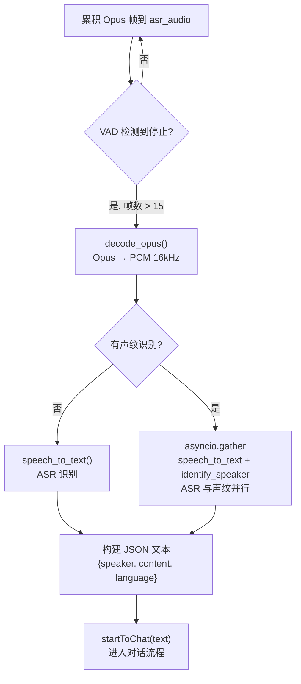
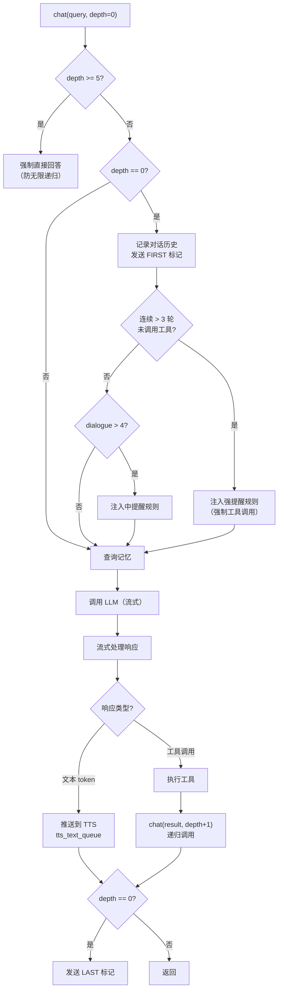
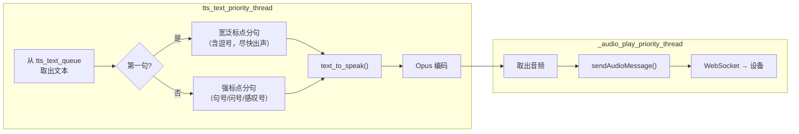
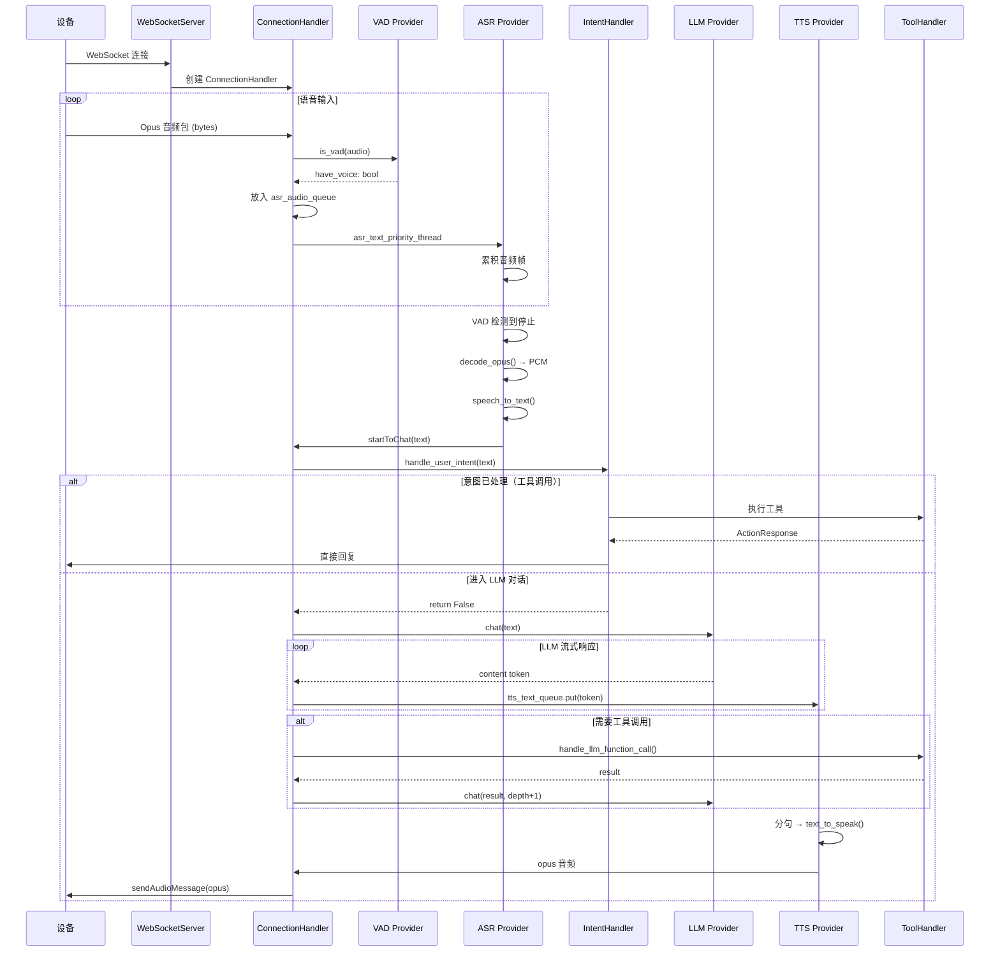

# xiaozhi-server 开发者培训手册

> 本文档面向全栈开发工程师，帮助快速理解 `main/xiaozhi-server` 模块的架构设计、核心流程和扩展方式。

---

## 1. 项目概览

### 1.1 项目简介

**xiaozhi-server** 是一个基于 Python 的 AI 语音助手服务端，通过 WebSocket 与 ESP32 等硬件设备通信，实现实时语音对话。

**核心处理管道：**

```
设备语音输入 ──→ [VAD] ──→ [ASR] ──→ [Intent/LLM] ──→ [TTS] ──→ 设备语音输出
                           │              │
                           └──────── [Memory] ←───────────────┘
```

**支持的服务商数量（截至本文档编写时）：**

| 类型 | 数量 | 说明 |
|------|------|------|
| ASR | 15+ | FunASR、Sherpa-ONNX、Doubao、Aliyun、Tencent、Baidu、OpenAI 等 |
| LLM | 15+ | ChatGLM、Doubao、DeepSeek、Gemini、Coze、Ollama、LM Studio 等 |
| TTS | 30+ | Edge TTS、Doubao、CosyVoice、GPT-SoVITS、Fish Speech 等 |
| VAD | 1 | Silero VAD |
| Memory | 5 | mem0ai、PowerMem、mem_local_short、nomem、mem_report_only |
| Intent | 3 | nointent、intent_llm、function_call |

### 1.2 技术栈速览

| 技术 | 用途 | 版本/备注 |
|------|------|-----------|
| Python | 编程语言 | 3.10+ |
| asyncio | 异步 I/O | 核心并发模型 |
| websockets | WebSocket 服务 | 14.2（cozepy 要求 <15.0.0） |
| aiohttp | HTTP 服务 | OTA 升级、视觉分析接口 |
| opuslib_next | Opus 编解码 | 音频数据压缩/解压 |
| torch/torchaudio | 本地 ML 推理 | 2.2.2（锁定版本） |
| numpy | 数值计算 | 1.26.4（锁定版本） |
| loguru | 日志 | 结构化日志 |
| PyJWT | 认证 | JWT Token 验证 |

### 1.3 服务端口与入口

**启动入口：** `main/xiaozhi-server/app.py`

启动后创建三个核心任务：

| 服务 | 端口 | 端点 | 用途 |
|------|------|------|------|
| WebSocket | 8000 | `ws://{host}:8000/xiaozhi/v1/` | 设备实时通信 |
| HTTP | 8003 | `http://{host}:8003/xiaozhi/ota/` | OTA 固件升级 |
| HTTP | 8003 | `http://{host}:8003/mcp/vision/explain` | 视觉图像分析 |
| GC 管理器 | - | 每 5 分钟运行 | 资源清理 |

**配置优先级链：**

```
data/.config.yaml（本地覆盖，git-ignored）
    ↓
config.yaml（默认配置）
    ↓
manager-api 远程配置（当 read_config_from_api: true 时）
```

### 1.4 目录结构导览

```
main/xiaozhi-server/
├── app.py                          # 入口：启动 WebSocket + HTTP + GC
├── config.yaml                     # 主配置（1150+ 行，含所有 Provider 配置）
├── agent-base-prompt.txt           # 系统提示词模板（Jinja2）
├── requirements.txt                # Python 依赖
├── config/                         # 配置管理
│   ├── settings.py                 # 配置加载
│   ├── logger.py                   # loguru 日志设置
│   └── config_loader.py            # 动态配置热加载
├── core/                           # 核心业务逻辑
│   ├── connection.py               # 连接处理器（~1473 行，核心协调器）
│   ├── websocket_server.py         # WebSocket 服务器
│   ├── http_server.py              # HTTP 服务器
│   ├── auth.py                     # JWT 认证
│   ├── handle/                     # 消息处理器
│   │   ├── textHandle.py           # 文本消息入口
│   │   ├── receiveAudioHandle.py   # 音频输入处理
│   │   ├── sendAudioHandle.py      # 音频输出处理
│   │   ├── intentHandler.py        # 意图识别
│   │   └── textHandler/            # 具体消息类型处理器
│   │       ├── helloMessageHandler.py
│   │       ├── listenMessageHandler.py
│   │       ├── iotMessageHandler.py
│   │       ├── mcpMessageHandler.py
│   │       ├── pingMessageHandler.py
│   │       └── serverMessageHandler.py
│   ├── providers/                  # AI Provider 实现
│   │   ├── asr/                    # 语音识别（15+ 实现）
│   │   ├── llm/                    # 大语言模型（15+ 实现）
│   │   ├── tts/                    # 语音合成（30+ 实现）
│   │   ├── vad/                    # 语音活动检测
│   │   ├── vllm/                   # 视觉语言模型
│   │   ├── memory/                 # 记忆管理
│   │   ├── intent/                 # 意图识别
│   │   └── tools/                  # 工具执行框架
│   └── utils/                      # 工具模块
│       ├── modules_initialize.py   # Provider 初始化
│       ├── dialogue.py             # 对话历史管理
│       ├── prompt_manager.py       # 提示词管理
│       └── audioRateController.py  # 音频流控
├── plugins_func/                   # 插件系统
│   ├── register.py                 # @register_function 装饰器
│   ├── loadplugins.py              # 自动加载器
│   └── functions/                  # 插件实现
│       ├── get_weather.py
│       ├── play_music.py
│       └── ...
└── test/                           # 测试资源
    └── test_page.html              # WebSocket 测试页面
```

---

## 2. 系统架构

### 2.1 整体架构图

```
┌─────────────────────────────────────────────────────────────────────────────┐
│                           xiaozhi-server                                    │
├─────────────────────────────────────────────────────────────────────────────┤
│                                                                             │
│  ┌─────────────┐     ┌─────────────────────┐     ┌─────────────────────┐    │
│  │   Device    │     │   WebSocketServer   │     │   SimpleHttpServer  │    │
│  │  (ESP32)    │◄───►│    (port 8000)      │     │    (port 8003)      │    │
│  └─────────────┘     └──────────┬──────────┘     └─────────────────────┘    │
│                                 │                                           │
│                    ┌────────────▼────────────┐                              │
│                    │    ConnectionHandler    │                              │
│                    │   (per-device session)  │                              │
│                    └────────────┬────────────┘                              │
│                                 │                                           │
│      ┌──────────┬───────────────┼──────────────┬──────────┐                 │
│      ▼          ▼               ▼              ▼          ▼                 │
│   ┌──────┐  ┌──────┐       ┌────────┐     ┌──────┐  ┌──────────┐            │
│   │ VAD  │  │ ASR  │       │  LLM   │     │ TTS  │  │ Memory   │            │
│   └──────┘  └──────┘       └────────┘     └──────┘  └──────────┘            │
│                                │                                            │
│                           ┌────▼────┐                                       │
│                           │ Intent  │                                       │
│                           │ Tools   │                                       │
│                           └────┬────┘                                       │
│              ┌─────────────────┼─────────────────┐                          │
│              ▼                 ▼                 ▼                          │
│        ┌──────────┐     ┌──────────┐     ┌──────────┐                       │
│        │  Weather │     │ Home Ass │     │   Music  │                       │
│        │  Plugin  │     │ Plugin   │     │  Plugin  │                       │
│        └──────────┘     └──────────┘     └──────────┘                       │
└─────────────────────────────────────────────────────────────────────────────┘
```

### 2.2 核心设计模式一览表

| 设计模式 | 应用位置 | 说明 |
|----------|----------|------|
| **Abstract Factory** | `core/utils/asr.py`、`llm.py`、`tts.py` | 每种 Provider 通过 `create_instance()` 工厂方法动态实例化 |
| **Strategy** | `config.yaml` 的 `selected_module` | 运行时切换不同的 Provider 实现，无需修改代码 |
| **Decorator** | `plugins_func/register.py` | `@register_function` 装饰器自动注册插件函数 |
| **Registry** | `core/handle/textMessageHandlerRegistry.py` | 消息类型 → Handler 的映射注册表 |
| **Observer/Queue** | TTS 的双队列设计 | `tts_text_queue` → `tts_audio_queue` 生产者-消费者解耦 |
| **Thread Pool** | `ConnectionHandler.executor` | 5 线程池执行阻塞操作（LLM 调用、工具执行） |

### 2.3 线程模型与并发设计

```mermaid
flowchart TB
    subgraph Main["主线程 (asyncio Event Loop)"]
        WS["WebSocket 收发"]
        HTTP["HTTP 请求"]
        AsyncIO["异步 I/O"]
    end

    subgraph Pool["ThreadPoolExecutor (5 workers)"]
        Chat["chat() LLM 对话"]
        Tool["工具调用执行"]
        Init["配置初始化"]
    end

    subgraph ASR_T["ASR 线程 (per-connection)"]
        ASR_Q["asr_audio_queue → handleAudioMessage()"]
    end

    subgraph TTS_T["TTS 线程 (per-connection)"]
        TTS_TXT["tts_text_queue → 分句 → 合成"]
        TTS_AUD["tts_audio_queue → sendAudioMessage()"]
    end

    Main -- "executor.submit()" --> Pool
    Main -- "queue.put()" --> ASR_T
    Pool -- "run_coroutine_threadsafe()" --> Main
    TTS_TXT -- "tts_audio_queue" --> TTS_AUD
```



**跨线程通信** 从线程池安全调用异步方法，使用 `asyncio.run_coroutine_threadsafe(coro, conn.loop)`。

**关键原则：**
- I/O 密集型操作使用 `async/await`
- CPU 密集型或阻塞 SDK 调用使用 `executor.submit()` 或 `asyncio.to_thread()`
- ASR/TTS 音频处理使用专用线程 + 队列，保证时序

---

## 3. 连接生命周期

### 3.1 连接建立流程

文件：`core/websocket_server.py` 第 81 行、`core/connection.py` 第 209 行



**两级详解：**

| 阶段 | 步骤 | 操作 | 文件位置 |
|------|------|------|---------|
| WebSocketServer | 1 | 提取 device-id（Headers 或 URL query 参数回退） | `websocket_server.py:82` |
| WebSocketServer | 2 | JWT 认证（白名单跳过，其余验证 Token） | `websocket_server.py:206` |
| WebSocketServer | 3 | 创建 ConnectionHandler（深拷贝 config/传入共享模块） | `websocket_server.py:117` |
| WebSocketServer | 4 | 调用 `handle_connection(ws)` | `websocket_server.py:131` |
| ConnectionHandler | 5 | 获取事件循环 `get_running_loop()` | `connection.py:209` |
| ConnectionHandler | 6 | 设置连接上下文/初始化（提取 IP/设备ID/检查 MQTT 来源/初始化时间戳/采样率） | `connection.py:215-252` |
| ConnectionHandler | 7 | 启动超时检查任务 `_check_timeout()` | `connection.py:244` |
| ConnectionHandler | 8 | 后台初始化 `_background_initialize()`（异步差异化配置） | `connection.py:594` |
| ConnectionHandler | 9 | 进入消息循环 `async for message in websocket` | `connection.py:256` |

### 3.2 设备绑定机制

当 `read_config_from_api: true` 时，设备首次连接需要绑定：



**实际流程：**
1. `_initialize_private_config_async()` 成功 → `need_bind=False` + `bind_completed_event.set()` → 直接进入消息循环
2. 失败 → `need_bind=True`，**但 event 保持未 set**
3. `_route_message()` 检测到 event 未 set，wait() 最多 1 秒超时
4. 超时 → `_discard_message_with_bind_prompt()` 播报 6 位绑定码
5. 用户去智控台完成绑定后重连，进入成功路径


### 3.3 消息路由机制

文件：`core/connection.py` 第 328 行 `_route_message()`

每条消息按类型分流：

| 消息类型 | 判断条件 | 目的地 |
|---------|---------|--------|
| 音频数据 | `isinstance(message, bytes)` | `asr_audio_queue`（MQTT 网关需解析 16 字节头部） |
| 文本消息 | `isinstance(message, str)` | `handleTextMessage()` → Registry 路由 |

未绑定设备的所有消息都会被丢弃，只播放绑定提示。

### 3.4 连接关闭与资源清理

文件：`core/connection.py` 第 269 行

清理严格按顺序执行：

```
1. 异步保存记忆（新线程，不阻塞关闭）
2. 停止 VAD → 取消超时任务 → 关闭工具处理器
3. 设置 stop_event（通知所有线程退出）
4. 清空队列 → 关闭 WebSocket
5. 关闭 TTS/ASR → 关闭线程池
```

---

## 4. 音频处理管道（核心）

### 管道总览



### 4.1 音频入站流程

```
设备 ──→ WebSocket bytes ──→ _route_message() ──→ asr_audio_queue
                                                     ↓
                                              asr_text_priority_thread
                                                     ↓
                                              handleAudioMessage()
```

文件：`core/handle/receiveAudioHandle.py` 第 17 行

每个音频帧经过 4 步：

| 步骤 | 操作 | 说明 |
|------|------|------|
| 1 | VAD 检测 | `conn.vad.is_vad(conn, audio)` |
| 2 | 打断检测 | 检测到语音 + 正在播放 → 中断播放 |
| 3 | 空闲超时 | 长时间无语音 → 自动结束对话 |
| 4 | 传递 ASR | `conn.asr.receive_audio(conn, audio, have_voice)` |

### 4.2 VAD 语音活动检测

文件：`core/providers/vad/silero.py`

- 模型：Silero VAD（ONNX 格式）
- 采样率：16kHz（固定）
- 分帧：512 样本/帧（约 32ms）
- 阈值：> 0.5 视为有语音

流程：`Opus → PCM (16kHz) → 分帧 → ONNX 推理 → 阈值判断`

VAD 状态变量（`connection.py`）：
- `client_have_voice`: 当前是否有语音
- `client_voice_stop`: 语音是否结束（用于触发 ASR）
- `client_voice_window`: 滑动窗口（deque maxlen=5），用于平滑检测

### 4.3 ASR 语音识别

文件：`core/providers/asr/base.py`



### 4.4 意图识别与路由

文件：`core/handle/intentHandler.py` 第 19 行

**三种 Intent 模式：**

| 模式 | 配置 | 行为 |
|------|------|------|
| `nointent` | `selected_module.Intent: nomem` | 跳过意图分析，直接进入 LLM 聊天 |
| `intent_llm` | `selected_module.Intent: intent_llm` | 使用独立 LLM 进行意图分析，返回 function_call 格式 |
| `function_call` | `selected_module.Intent: function_call` | 跳过独立意图分析，直接用 LLM 的 function calling |

**决策链：** 退出命令 → 唤醒词 → 按 Intent 模式分流

### 4.5 LLM 大模型对话

文件：`core/connection.py` 第 834 行 `chat()` 方法



**关键设计：**

| 机制 | 说明 |
|------|------|
| 防偷懒 | 连续 > 3 轮未调用工具时注入**强提醒**；对话 > 4 条时注入**中提醒** |
| 临时消息 | `is_temporary=True` 的消息本轮后自动清理，不污染对话历史 |
| 递归上限 | `MAX_DEPTH = 5`，防止工具调用无限递归 |

### 4.6 TTS 文本转语音

文件：`core/providers/tts/base.py`

**双队列架构：**



**三种接口类型：**

| 类型 | 说明 | 示例 Provider |
|------|------|---------------|
| `NON_STREAM` | 整句合成后返回 | 大多数云 TTS |
| `SINGLE_STREAM` | 单流式（文本流或音频流） | MiniMax HTTP Stream |
| `DUAL_STREAM` | 双流式（文本流 + 音频流并行） | 讯飞 / 火山引擎 |

### 4.7 音频出站流程

文件：`core/handle/sendAudioHandle.py`

- **预缓冲：** 前 5 个包直接发送（`PRE_BUFFER_COUNT = 5`），减少首包延迟
- **流控：** 后续包通过 `AudioRateController` 匀速发送，防止设备缓冲区溢出
- **MQTT 网关：** 音频包添加 16 字节头部（type + length + sequence + timestamp）

### 4.8 完整管道流程图



---

## 5. Provider 系统

### 5.1 七大 Provider 类型总览

| Provider | 目录 | 核心方法 | 状态 |
|----------|------|----------|------|
| VAD | `core/providers/vad/` | `is_vad()` | 无状态，共享实例 |
| ASR | `core/providers/asr/` | `speech_to_text()` | 本地共享，远程独立 |
| LLM | `core/providers/llm/` | `response()` | 无状态，共享实例 |
| TTS | `core/providers/tts/` | `text_to_speak()` | 有状态（队列），独立实例 |
| Memory | `core/providers/memory/` | `save_memory()`, `query_memory()` | 共享实例 |
| Intent | `core/providers/intent/` | `detect_intent()` | 共享实例 |
| VLLM | `core/providers/vllm/` | - | 可选，共享实例 |

### 5.2 三层架构

每种 Provider 遵循统一的三层架构，无需修改框架代码即可添加新实现：

```
Layer 1: 抽象基类 (Base)       → 定义接口，提供 decode_opus() 等通用工具
         ↓
Layer 2: 具体实现 (Provider)    → 继承基类，实现 speech_to_text() / response() 等
         ↓
Layer 3: 工厂方法 (Factory)     → create_instance() 通过 importlib 动态加载
```

**ASR 基类核心接口：**

| 方法 | 类型 | 说明 |
|------|------|------|
| `speech_to_text()` | 抽象 | 子类必须实现，核心识别逻辑 |
| `decode_opus()` | 静态 | Opus → PCM (16kHz)，通用工具 |
| `receive_audio()` | 通用 | 累积音频，VAD 停止时触发识别 |
| `handle_voice_stop()` | 通用 | 解码 → WAV → speech_to_text → startToChat |

### 5.3 共享 vs 独立实例

```python
# WebSocketServer 启动时 — 创建共享实例
modules = initialize_modules(
    init_vad=True, init_llm=True, init_memory=True, init_intent=True,
    init_tts=False,    # TTS 必须独立！有音频队列状态
    init_asr=True      # 本地可共享，远程需独立
)
```

| Provider | 共享/独立 | 原因 |
|----------|----------|------|
| VAD / LLM / Intent / Memory | 共享 | 无状态 |
| TTS | 独立 | 持有 `tts_text_queue` + `tts_audio_queue` |
| ASR（本地如 sherpa_onnx） | 共享 | 单次推理无状态 |
| ASR（远程如 FunASR WS） | 独立 | 持有 WebSocket 连接和接收线程 |

### 5.4 如何添加新 Provider

以添加新 ASR 为例，只需 3 步：

**步骤 1：** 创建 `core/providers/asr/my_asr.py`

```python
from core.providers.asr.base import ASRProviderBase

class ASRProvider(ASRProviderBase):
    def __init__(self, config, delete_audio_file=True):
        super().__init__()
        self.output_dir = config.get("output_dir", "tmp/")

    async def speech_to_text(self, opus_data, session_id,
                             audio_format="opus", artifacts=None):
        # artifacts.pcm_bytes 已由基类解码好
        text = await self._recognize(artifacts.pcm_bytes)
        return text, artifacts.file_path if artifacts else None
```

**步骤 2：** 在 `config.yaml` 添加配置并指定 `selected_module.ASR: my_asr`

**步骤 3：** 完成！工厂 `create_instance()` 通过 `importlib` 自动发现并加载。

---

## 6. 插件系统

### 6.1 插件架构概览

```
plugins_func/functions/ 目录下所有 .py 文件
         ↓ auto_import_modules()
@register_function 装饰器自动执行
         ↓
all_function_registry 全局注册表
         ↓
ServerPluginExecutor 按需调用
```

系统启动时自动扫描 `plugins_func/functions/` 目录，开发者只需将文件放到该目录，无需修改注册代码。

### 6.2 ToolType / Action / ActionResponse

**ToolType（工具类型）：**

| 类型 | code | 用途 | 是否传 conn |
|------|------|------|-------------|
| NONE | 1 | 调用后无其他操作 | 否 |
| WAIT | 2 | 等待函数返回 | 否 |
| CHANGE_SYS_PROMPT | 3 | 修改系统提示词 | 是 |
| SYSTEM_CTL | 4 | 系统控制（退出、音乐等） | 是 |
| IOT_CTL | 5 | IoT 设备控制 | 是 |
| MCP_CLIENT | 6 | MCP 客户端 | - |

**Action（执行后动作）：**

| Action | 含义 |
|--------|------|
| `REQLLM` | 将 result 传给 LLM，让 LLM 生成自然语言回复（**最常用**） |
| `RESPONSE` | 直接将 response 发送给用户 |
| `NONE` | 无后续操作 |
| `ERROR` | 出错 |

### 6.3 统一工具处理器

文件：`core/providers/tools/unified_tool_handler.py`

五种执行器：

| 执行器 | 用途 |
|--------|------|
| ServerPluginExecutor | 执行本地 Python 插件 |
| ServerMCPExecutor | 服务端 MCP 工具调用 |
| DeviceIoTExecutor | 设备端 IoT 控制 |
| DeviceMCPExecutor | 设备端 MCP 调用 |
| MCPEndpointExecutor | 外部 MCP Endpoint |

### 6.4 如何添加新插件

完整示例 — 获取当前时间：

```python
# plugins_func/functions/get_current_time.py
from datetime import datetime
from plugins_func.register import register_function, ToolType, ActionResponse, Action

GET_CURRENT_TIME_DESC = {
    "type": "function",
    "function": {
        "name": "get_current_time",
        "description": "获取当前日期、时间和星期几",
        "parameters": {"type": "object", "properties": {}, "required": []}
    }
}

@register_function("get_current_time", GET_CURRENT_TIME_DESC, ToolType.SYSTEM_CTL)
def get_current_time(conn, **kwargs):
    now = datetime.now()
    result = f"当前时间：{now.strftime('%Y年%m月%d日 %H:%M')}"
    return ActionResponse(Action.REQLLM, result, None)
```

在配置的 `functions` 列表中添加 `get_current_time` 即可启用。

---

## 7. 配置系统

### 7.1 配置文件结构

`config.yaml`（1150+ 行）主要配置节：

| 配置节 | 用途 |
|------|------|
| `server` | IP、端口、认证、MQTT 网关 |
| `selected_module` | 选择使用哪个 Provider |
| `ASR` / `LLM` / `TTS` 等 | 各 Provider 的具体配置 |
| `xiaozhi` | 欢迎语、音频参数（opus, 24kHz, 1ch, 60ms） |
| `prompt` | 系统提示词 |
| `exit_commands` | 退出命令列表 |
| `plugins` | 插件开关与配置 |

### 7.2 配置优先级

```
data/.config.yaml（本地覆盖，git-ignored） > config.yaml（默认） > manager-api 远程配置
```

每个设备可按 device-id 获取差异化配置（`get_private_config_from_api()`）。

### 7.3 系统提示词管理

文件：`core/utils/prompt_manager.py`、`agent-base-prompt.txt`

模板使用 Jinja2 格式，上下文变量自动注入：

| 变量 | 内容 |
|------|------|
| `{{current_time}}` | 当前时间 |
| `{{today_date}}` | 今天日期 |
| `{{lunar_date}}` | 农历日期 |
| `{{local_address}}` | 设备位置 |
| `{{weather_info}}` | 天气信息 |

两阶段初始化：`get_quick_prompt()`（快速）→ `build_enhanced_prompt()`（异步增强）

---

## 8. 通信协议

### 8.1 WebSocket 协议

**端点：** `ws://{host}:8000/xiaozhi/v1/?device-id=xxx&client-id=xxx`

### 8.2 设备 → 服务端

| type | 说明 | 处理文件 |
|------|------|----------|
| `hello` | 握手，交换音频参数 | `helloMessageHandler.py` |
| `listen` | 监听模式切换 | `listenMessageHandler.py` |
| `abort` | 中断当前播放 | `abortMessageHandler.py` |
| `iot` | IoT 设备描述/控制 | `iotMessageHandler.py` |
| `mcp` | MCP 协议消息 | `mcpMessageHandler.py` |
| `server` | 服务器管理指令 | `serverMessageHandler.py` |
| `ping` | 心跳检测 | `pingMessageHandler.py` |
| (bytes) | Opus 音频数据 | `receiveAudioHandle.py` |

### 8.3 服务端 → 设备

| type | 说明 | 关键字段 |
|------|------|----------|
| `stt` | ASR 识别文本 | `text`, `session_id` |
| `tts` | TTS 状态 | `state: start/stop`, `text` |
| (bytes) | Opus 音频数据 | - |

---

## 9. 开发者实操速查

### 9.1 环境搭建

```bash
# 1. Python 3.10 + ffmpeg
pip install -r requirements.txt

# 2. 本地配置
cp config.yaml data/.config.yaml
# 编辑 data/.config.yaml，配置 API 密钥

# 3. 启动
python app.py

# 4. 测试：用 Chrome 打开 test/test_page.html
```

### 9.2 常见开发任务速查

| 任务 | 涉及文件 | 关键步骤 |
|------|----------|----------|
| 添加 ASR | `core/providers/asr/my_asr.py` + `config.yaml` | 继承 `ASRProviderBase`，实现 `speech_to_text()` |
| 添加 LLM | `core/providers/llm/my_llm/my_llm.py` | 继承 `LLMProviderBase`，实现 `response()` |
| 添加 TTS | `core/providers/tts/my_tts.py` | 继承 `TTSProviderBase`，实现 `text_to_speak()` |
| 添加插件 | `plugins_func/functions/my_plugin.py` | 使用 `@register_function` 装饰器 |
| 修改消息处理 | `core/handle/textHandler/` | 创建 Handler，注册到 Registry |
| 修改提示词 | `agent-base-prompt.txt` | 使用 Jinja2 模板语法 |

### 9.3 日志规范

使用 loguru 并绑定 tag：`logger.bind(tag=__name__).info("消息")`

### 9.4 常见坑点

1. **API 密钥安全** — `config.yaml` 含密钥，`data/.config.yaml` 已 git-ignored
2. **Opus 采样率** — 服务端 24kHz，VAD 固定 16kHz，须与客户端一致
3. **connection.py 是核心** — ~1473 行，修改前务必通读
4. **ASR 实例策略** — 本地 ASR 共享，远程 ASR 每连接独立
5. **工具调用深度** — 最大递归 5 层（`MAX_DEPTH = 5`）
6. **临时消息** — `is_temporary=True` 的消息每轮自动清理

---

## 10. 附录

### A. 术语表

| 术语 | 英文 | 说明 |
|------|------|------|
| VAD | Voice Activity Detection | 语音活动检测 |
| ASR | Automatic Speech Recognition | 自动语音识别（语音→文字） |
| TTS | Text-to-Speech | 文本转语音（文字→语音） |
| LLM | Large Language Model | 大语言模型 |
| STT | Speech-to-Text | 语音转文字（同 ASR） |
| Opus | Opus Codec | 低延迟高压缩音频编解码 |
| MCP | Model Context Protocol | 模型上下文协议（工具调用标准） |
| OTA | Over-the-Air | 空中升级（固件远程更新） |

### B. 参考资源

- **项目仓库：** https://github.com/xinnan-tech/xiaozhi-esp32-server
- **核心文件：** `core/connection.py` · `core/websocket_server.py` · `plugins_func/register.py`
- **依赖版本（锁定）：** `torch==2.2.2` · `numpy==1.26.4` · `websockets==14.2`

---

*本文档基于 xiaozhi-server 代码编写，如有更新请以代码为准。*
