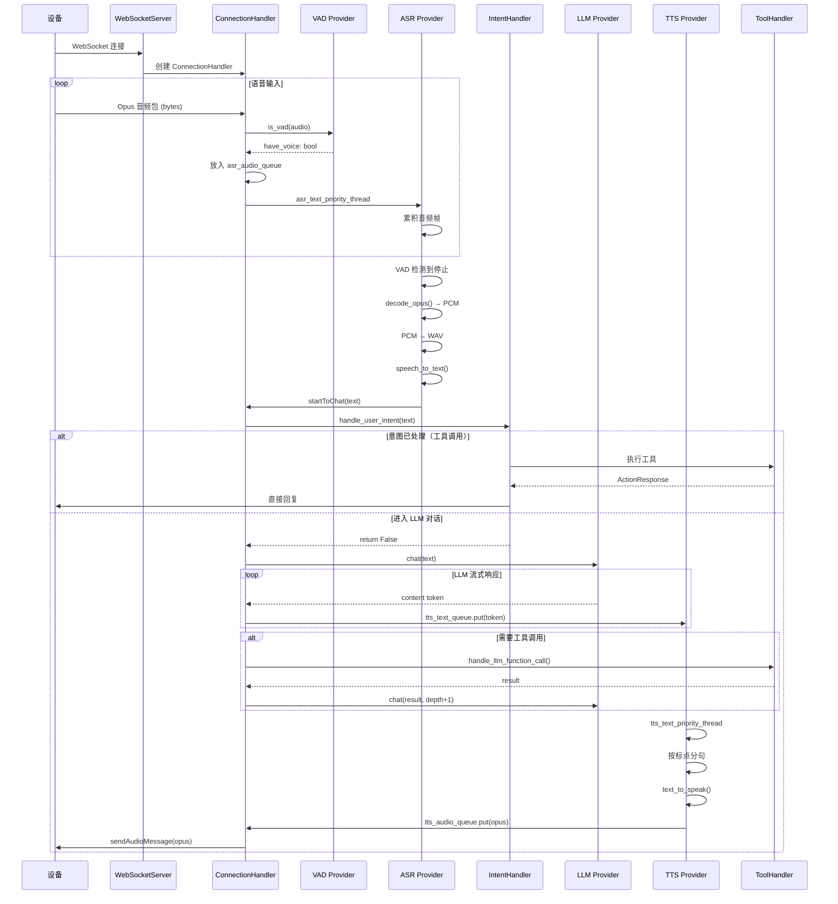

# xiaozhi-server 开发者培训手册

> 本文档面向全栈开发工程师，帮助快速理解 `main/xiaozhi-server` 模块的架构设计、核心流程和扩展方式。

---

## 1. 项目概览

### 1.1 项目简介

**xiaozhi-server** 是一个基于 Python 的 AI 语音助手服务端，通过 WebSocket 与 ESP32 等硬件设备通信，实现实时语音对话。

**核心处理管道：**

```
设备语音输入 ──→ [VAD] ──→ [ASR] ──→ [Intent/LLM] ──→ [TTS] ──→ 设备语音输出
                                       │
                                       ↓ (query: ASR输出文本)
                                    [Memory]
                                       ↑ (save at session end)
```

**支持的服务商数量（截至本文档编写时）：**

| 类型 | 数量 | 说明 |
|------|------|------|
| ASR | 15+ | FunASR、Sherpa-ONNX、Doubao、Aliyun、Tencent、Baidu、OpenAI 等 |
| LLM | 15+ | ChatGLM、Doubao、DeepSeek、Gemini、Coze、Ollama、LM Studio 等 |
| TTS | 30+ | Edge TTS、Doubao、CosyVoice、GPT-SoVITS、Fish Speech 等 |
| VAD | 1 | Silero VAD |
| Memory | 5 | mem0ai、PowerMem、mem_local_short、nomem、mem_report_only |
| Intent | 3 | nointent、intent_llm、function_call |

### 1.2 技术栈速览

| 技术 | 用途 | 版本/备注 |
|------|------|-----------|
| Python | 编程语言 | 3.10+ |
| asyncio | 异步 I/O | 核心并发模型 |
| websockets | WebSocket 服务 | 14.2（cozepy 要求 <15.0.0） |
| aiohttp | HTTP 服务 | OTA 升级、视觉分析接口 |
| opuslib_next | Opus 编解码 | 音频数据压缩/解压 |
| torch/torchaudio | 本地 ML 推理 | 2.2.2（锁定版本） |
| numpy | 数值计算 | 1.26.4（锁定版本） |
| loguru | 日志 | 结构化日志 |
| PyJWT | 认证 | JWT Token 验证 |

### 1.3 服务端口与入口

**启动入口：** `main/xiaozhi-server/app.py`

启动后创建三个核心任务：

| 服务 | 端口 | 端点 | 用途 |
|------|------|------|------|
| WebSocket | 8000 | `ws://{host}:8000/xiaozhi/v1/` | 设备实时通信 |
| HTTP | 8003 | `http://{host}:8003/xiaozhi/ota/` | OTA 固件升级 |
| HTTP | 8003 | `http://{host}:8003/mcp/vision/explain` | 视觉图像分析 |
| GC 管理器 | - | 每 5 分钟运行 | 资源清理 |

**配置优先级链：**

```
data/.config.yaml（本地覆盖，git-ignored）
    ↓
config.yaml（默认配置）
    ↓
manager-api 远程配置（当 read_config_from_api: true 时）
```

### 1.4 目录结构导览

```
main/xiaozhi-server/
├── app.py                          # 入口：启动 WebSocket + HTTP + GC
├── config.yaml                     # 主配置（1150+ 行，含所有 Provider 配置）
├── agent-base-prompt.txt           # 系统提示词模板（Jinja2）
├── requirements.txt                # Python 依赖
├── config/                         # 配置管理
│   ├── settings.py                 # 配置加载
│   ├── logger.py                   # loguru 日志设置
│   └── config_loader.py            # 动态配置热加载
├── core/                           # 核心业务逻辑
│   ├── connection.py               # 连接处理器（~1473 行，核心协调器）
│   ├── websocket_server.py         # WebSocket 服务器
│   ├── http_server.py              # HTTP 服务器
│   ├── auth.py                     # JWT 认证
│   ├── handle/                     # 消息处理器
│   │   ├── textHandle.py           # 文本消息入口
│   │   ├── receiveAudioHandle.py   # 音频输入处理
│   │   ├── sendAudioHandle.py      # 音频输出处理
│   │   ├── intentHandler.py        # 意图识别
│   │   └── textHandler/            # 具体消息类型处理器
│   │       ├── helloMessageHandler.py
│   │       ├── listenMessageHandler.py
│   │       ├── iotMessageHandler.py
│   │       ├── mcpMessageHandler.py
│   │       ├── pingMessageHandler.py
│   │       └── serverMessageHandler.py
│   ├── providers/                  # AI Provider 实现
│   │   ├── asr/                    # 语音识别（15+ 实现）
│   │   ├── llm/                    # 大语言模型（15+ 实现）
│   │   ├── tts/                    # 语音合成（30+ 实现）
│   │   ├── vad/                    # 语音活动检测
│   │   ├── vllm/                   # 视觉语言模型
│   │   ├── memory/                 # 记忆管理
│   │   ├── intent/                 # 意图识别
│   │   └── tools/                  # 工具执行框架
│   └── utils/                      # 工具模块
│       ├── modules_initialize.py   # Provider 初始化
│       ├── dialogue.py             # 对话历史管理
│       ├── prompt_manager.py       # 提示词管理
│       └── audioRateController.py  # 音频流控
├── plugins_func/                   # 插件系统
│   ├── register.py                 # @register_function 装饰器
│   ├── loadplugins.py              # 自动加载器
│   └── functions/                  # 插件实现
│       ├── get_weather.py
│       ├── play_music.py
│       └── ...
└── test/                           # 测试资源
    └── test_page.html              # WebSocket 测试页面
```

---

## 2. 系统架构

### 2.1 整体架构图

```
┌─────────────────────────────────────────────────────────────────────────────┐
│                           xiaozhi-server                                    │
├─────────────────────────────────────────────────────────────────────────────┤
│                                                                             │
│  ┌─────────────┐     ┌─────────────────────┐     ┌─────────────────────┐    │
│  │   Device    │     │   WebSocketServer   │     │   SimpleHttpServer  │    │
│  │  (ESP32)    │◄───►│    (port 8000)      │     │    (port 8003)      │    │
│  └─────────────┘     └──────────┬──────────┘     └─────────────────────┘    │
│                                 │                                           │
│                    ┌────────────▼────────────┐                              │
│                    │    ConnectionHandler    │                              │
│                    │   (per-device session)  │                              │
│                    └────────────┬────────────┘                              │
│                                 │                                           │
│      ┌──────────┬───────────────┼──────────────┬──────────┐                 │
│      ▼          ▼               ▼              ▼          ▼                 │
│   ┌──────┐  ┌──────┐       ┌────────┐     ┌──────┐  ┌──────────┐            │
│   │ VAD  │  │ ASR  │       │  LLM   │     │ TTS  │  │ Memory   │            │
│   └──────┘  └──────┘       └────────┘     └──────┘  └──────────┘            │
│                                │                                            │
│                           ┌────▼────┐                                       │
│                           │ Intent  │                                       │
│                           │ Tools   │                                       │
│                           └────┬────┘                                       │
│                                │                                            │
│              ┌─────────────────┼─────────────────┐                          │
│              ▼                 ▼                 ▼                          │
│        ┌──────────┐     ┌──────────┐     ┌──────────┐                       │
│        │  Weather │     │ Home Ass │     │   Music  │                       │
│        │  Plugin  │     │ Plugin   │     │  Plugin  │                       │
│        └──────────┘     └──────────┘     └──────────┘                       │
│                                                                             │
└─────────────────────────────────────────────────────────────────────────────┘
```

### 2.2 核心设计模式一览表

| 设计模式 | 应用位置 | 说明 |
|----------|----------|------|
| **Abstract Factory** | `core/utils/asr.py`、`llm.py`、`tts.py` | 每种 Provider 通过 `create_instance()` 工厂方法动态实例化 |
| **Strategy** | `config.yaml` 的 `selected_module` | 运行时切换不同的 Provider 实现，无需修改代码 |
| **Decorator** | `plugins_func/register.py` | `@register_function` 装饰器自动注册插件函数 |
| **Registry** | `core/handle/textMessageHandlerRegistry.py` | 消息类型 → Handler 的映射注册表 |
| **Observer/Queue** | TTS 的双队列设计 | `tts_text_queue` → `tts_audio_queue` 生产者-消费者解耦 |
| **Thread Pool** | `ConnectionHandler.executor` | 5 线程池执行阻塞操作（LLM 调用、工具执行） |

### 2.3 线程模型与并发设计

```
主线程 (asyncio Event Loop)
    ├── WebSocket 消息收发
    ├── HTTP 请求处理
    └── 异步 I/O 操作 (VAD、ASR、TTS 队列写入)

ThreadPoolExecutor (5 workers)
    ├── chat() LLM 对话
    ├── 工具调用执行
    └── 配置初始化 (initialize_modules)

ASR 专属线程 (per-connection)
    └── asr_text_priority_thread
        └── 从 asr_audio_queue 取音频 → handleAudioMessage()

TTS 专属线程 (per-connection)
    ├── tts_text_priority_thread
    │   └── 从 tts_text_queue 取文本 → 分句 → 合成音频 → tts_audio_queue
    └── _audio_play_priority_thread
        └── 从 tts_audio_queue 取音频 → sendAudioMessage()

上报线程 (per-connection)
    └── 聊天记录上报
```

**跨线程通信：** 从线程池安全调用异步方法：

```python
future = asyncio.run_coroutine_threadsafe(
    self.func_handler.handle_llm_function_call(conn, tool_call),
    conn.loop  # 主线程的事件循环
)
result = future.result()  # 阻塞等待结果
```

**关键原则：**
- I/O 密集型操作使用 `async/await`
- CPU 密集型或阻塞 SDK 调用使用 `executor.submit()` 或 `asyncio.to_thread()`
- ASR/TTS 音频处理使用专用线程 + 队列，保证时序

---

## 3. 连接生命周期

### 3.1 连接建立流程

文件：`core/websocket_server.py` 第 81 行起

```python
async def _handle_connection(self, websocket):
    # 1. 提取 Headers（支持 URL query parameter 回退）
    headers = dict(websocket.request.headers)
    if not headers.get("device-id"):
        # 从 URL query 参数解析 device-id
        ...

    # 2. JWT 认证
    await self._handle_auth(websocket)

    # 3. 创建 ConnectionHandler（每个连接独立）
    handler = ConnectionHandler(
        self.config, self._vad, self._asr, self._llm,
        self._memory, self._intent, self
    )

    # 4. 处理连接
    await handler.handle_connection(websocket)
```

文件：`core/connection.py` 第 209 行起

```python
async def handle_connection(self, ws):
    # 1. 获取事件循环（用于跨线程回调）
    self.loop = asyncio.get_running_loop()

    # 2. 提取客户端信息
    self.headers = dict(ws.request.headers)
    self.device_id = self.headers.get("device-id")
    self.client_ip = extract_real_ip(headers, ws)

    # 3. 启动超时检查任务
    self.timeout_task = asyncio.create_task(self._check_timeout())

    # 4. 后台初始化配置和组件（不阻塞主循环）
    asyncio.create_task(self._background_initialize())

    # 5. 进入消息循环
    async for message in self.websocket:
        await self._route_message(message)
```

### 3.2 设备绑定机制

当 `read_config_from_api: true` 时，设备首次连接需要绑定：

```python
# connection.py 第 604 行起
async def _initialize_private_config_async(self):
    try:
        private_config = await get_private_config_from_api(...)
        self.need_bind = False
        self.bind_completed_event.set()  # 允许消息处理
    except DeviceNotFoundException as e:
        self.need_bind = True
        # event 保持未 set，消息被挂起
    except DeviceBindException as e:
        self.need_bind = True
        self.bind_code = e.bind_code  # 6 位绑定码
        # event 保持未 set，消息被挂起
```

```python
# connection.py 第 328 行起
async def _route_message(self, message):
    if not self.bind_completed_event.is_set():
        try:
            await asyncio.wait_for(self.bind_completed_event.wait(), timeout=1)
        except asyncio.TimeoutError:
            # 1 秒超时后播报绑定码
            await self._discard_message_with_bind_prompt()
            return

    if self.need_bind:
        await self._discard_message_with_bind_prompt()
        return
    # ... 正常消息处理
```

**完整流程：**
1. 成功 → `need_bind=False` + `event.set()` → 直接进入消息循环
2. 失败 → `need_bind=True`，**但 event 保持未 set**
3. `_route_message()` 检测 event 未 set，wait() 最多 1 秒超时
4. 超时 → `_discard_message_with_bind_prompt()` 播报 6 位绑定码，所有消息被丢弃
5. 用户去智控台完成绑定后重连，进入成功路径

### 3.3 消息路由机制

文件：`core/connection.py` 第 328 行 `_route_message()`

```python
async def _route_message(self, message):
    # 检查绑定状态，未绑定则丢弃消息
    if not self.bind_completed_event.is_set():
        await self._discard_message_with_bind_prompt()
        return
    if self.need_bind:
        await self._discard_message_with_bind_prompt()
        return

    # 消息分流
    if isinstance(message, str):
        # 文本消息 → 处理器注册表
        await handleTextMessage(self, message)
    elif isinstance(message, bytes):
        # 音频消息 → ASR 队列
        if self.conn_from_mqtt_gateway:
            # MQTT 网关特殊处理（16 字节头部）
            await self._process_mqtt_audio_message(message)
        else:
            self.asr_audio_queue.put(message)
```

### 3.4 连接关闭与资源清理

文件：`core/connection.py` 第 269 行起

```python
async def _save_and_close(self, ws):
    try:
        # 1. 异步保存记忆（在新线程中，不阻塞关闭）
        if self.memory:
            threading.Thread(target=save_memory_task, daemon=True).start()
    finally:
        # 2. 立即关闭连接（不等记忆保存完成）
        await self.close(ws)

async def close(self, ws):
    # 清理顺序很重要！
    # 1. 停止 VAD
    # 2. 取消超时任务
    # 3. 关闭工具处理器
    # 4. 设置停止事件（通知所有线程）
    # 5. 清空队列
    # 6. 关闭 WebSocket
    # 7. 关闭 TTS/ASR
    # 8. 关闭线程池
```

---

## 4. 音频处理管道（核心）

### 4.1 音频入站流程

```
设备 ──→ WebSocket bytes ──→ _route_message() ──→ asr_audio_queue
                                                     ↓
                                              asr_text_priority_thread
                                                     ↓
                                              handleAudioMessage()
```

文件：`core/handle/receiveAudioHandle.py` 第 17 行

```python
async def handleAudioMessage(conn, audio):
    # 1. VAD 检测
    have_voice = conn.vad.is_vad(conn, audio)

    # 2. 打断检测（检测到语音时中断当前播放）
    if have_voice and conn.client_is_speaking:
        await handleAbortMessage(conn)

    # 3. 空闲超时检测
    await no_voice_close_connect(conn, have_voice)

    # 4. 传递给 ASR
    await conn.asr.receive_audio(conn, audio, have_voice)
```

### 4.2 VAD 语音活动检测

文件：`core/providers/vad/silero.py`

- 模型：Silero VAD（ONNX 格式）
- 采样率：16kHz（固定）
- 分帧：512 样本/帧（约 32ms）
- 阈值：> 0.5 视为有语音

```python
# 流程：Opus → PCM (16kHz) → 分帧 → ONNX 推理 → 阈值判断
def is_vad(self, conn, data):
    pcm_data = self._decode_opus(data)
    for frame in split_frames(pcm_data, 512):
        prob = self.model(frame)
        if prob > self.threshold:
            return True
    return False
```

VAD 状态变量（`connection.py`）：
- `client_have_voice`: 当前是否有语音
- `client_voice_stop`: 语音是否结束（用于触发 ASR）
- `client_voice_window`: 滑动窗口（deque maxlen=5），用于平滑检测

### 4.3 ASR 语音识别

文件：`core/providers/asr/base.py`

**流程：**

```
Opus 帧列表 ──→ decode_opus() ──→ PCM 帧列表 ──→ 合并为 PCM bytes
                                                     ↓
                                              WAV 编码 ──→ 保存文件
                                                     ↓
                                              speech_to_text()
                                                     ↓
                                              识别结果文本
```

**`receive_audio()` 逻辑：**

```python
async def receive_audio(self, conn, audio, audio_have_voice):
    if conn.client_listen_mode == "manual":
        # 手动模式：累积所有音频
        conn.asr_audio.append(audio)
    else:
        # 自动模式：VAD 检测
        conn.asr_audio.append(audio)

        # 无语音时只保留最后 10 帧（约 600ms）
        if not audio_have_voice and not conn.client_have_voice:
            conn.asr_audio = conn.asr_audio[-10:]
            return

        # VAD 检测到停止时触发识别
        if conn.client_voice_stop:
            asr_audio_task = conn.asr_audio.copy()
            conn.reset_audio_states()

            if len(asr_audio_task) > 15:  # 至少 15 帧才识别
                await self.handle_voice_stop(conn, asr_audio_task)
```

**`handle_voice_stop()` 并行处理：**

```python
async def handle_voice_stop(self, conn, asr_audio_task):
    # 并行执行 ASR + 声纹识别
    if conn.voiceprint_provider:
        asr_task = self.speech_to_text_wrapper(...)
        voiceprint_task = conn.voiceprint_provider.identify_speaker(...)
        asr_result, speaker_name = await asyncio.gather(
            asr_task, voiceprint_task, return_exceptions=True
        )
    else:
        asr_result = await self.speech_to_text_wrapper(...)

    # 构建包含说话人信息的 JSON 文本
    enhanced_text = json.dumps({
        "speaker": speaker_name,
        "content": asr_text,
        "language": detected_lang,
        "emotion": detected_emotion
    })

    # 进入对话流程
    await startToChat(conn, enhanced_text)
```

### 4.4 意图识别与路由

文件：`core/handle/intentHandler.py` 第 19 行

**三种 Intent 模式：**

| 模式 | 配置 | 行为 |
|------|------|------|
| `nointent` | `selected_module.Intent: nomem` | 跳过意图分析，直接进入 LLM 聊天 |
| `intent_llm` | `selected_module.Intent: intent_llm` | 使用独立 LLM 进行意图分析，返回 function_call 格式 |
| `function_call` | `selected_module.Intent: function_call` | 跳过独立意图分析，直接用 LLM 的 function calling |

**决策链：**

```python
async def handle_user_intent(conn, text):
    # 1. 退出命令检查
    if await check_direct_exit(conn, text):
        return True  # 已处理

    # 2. 唤醒词检查
    if await checkWakeupWords(conn, text):
        return True  # 已处理

    # 3. function_call 模式直接跳过
    if conn.intent_type == "function_call":
        return False  # 交给 LLM 处理

    # 4. intent_llm 模式
    intent_result = await analyze_intent_with_llm(conn, text)
    return await process_intent_result(conn, intent_result, text)
```

### 4.5 LLM 大模型对话

文件：`core/connection.py` 第 834 行 `chat()` 方法

**流程概览：**

```python
def chat(self, query, depth=0):
    MAX_DEPTH = 5
    force_final_answer = False

    # 1. 防止无限递归
    if depth >= MAX_DEPTH:
        force_final_answer = True
        self.dialogue.put(Message(role="user", content="[系统提示] 已达到最大工具调用次数限制，直接给出最终答案。"))

    # 2. depth==0 时：记录对话历史 + 发送 FIRST 标记
    if depth == 0:
        self.sentence_id = str(uuid.uuid4().hex)
        self.dialogue.put(Message(role="user", content=query))
        self.tts.tts_text_queue.put(TTSMessageDTO(sentence_id=self.sentence_id, sentence_type=SentenceType.FIRST, content_type=ContentType.ACTION))

    # 3. 工具调用规则注入（防偷懒：强提醒/中提醒两级）
    # 条件：depth==0 AND query非空 AND function_call模式 AND 对话>4条
    tool_call_reminder = None
    if depth == 0 and query is not None and functions is not None:
        dialogue_length = len(self.dialogue.dialogue)
        if dialogue_length > 4:
            tool_summary = self._get_tool_summary(functions)
            if force_reminder:  # 强提醒：连续 >3 轮未调用工具
                tool_call_reminder = TOOL_CALLING_RULES + "[重要提醒] 多轮未使用工具，本轮必须重新判断！当前可用工具: " + tool_summary
            else:  # 中提醒：普通长对话
                tool_call_reminder = TOOL_CALLING_RULES + "当前可用工具: " + tool_summary
    if tool_call_reminder:
        self.dialogue.put(Message(role="user", content=tool_call_reminder, is_temporary=True))

    # 4. 查询记忆
    memory_str = None
    if self.memory and query:
        memory_str = self.memory.query_memory(query)

    # 5. 调用 LLM（流式）
    if self.intent_type == "function_call" and functions is not None and not force_final_answer:
        llm_responses = self.llm.response_with_functions(session_id, self.dialogue.get_llm_dialogue_with_memory(memory_str), functions=functions)
    else:
        llm_responses = self.llm.response(session_id, self.dialogue.get_llm_dialogue_with_memory(memory_str))

    # 6. 流式处理响应
    for response in llm_responses:
        if tool_call_detected:
            tool_calls_list.append(tool_call_data)
        else:
            self.tts.tts_text_queue.put(TTSMessageDTO(sentence_id=self.sentence_id, sentence_type=SentenceType.MIDDLE, content_type=ContentType.TEXT, content_detail=content))

    # 7. 处理工具调用
    if tool_calls_list:
        for tool_call in tool_calls_list:
            result = self.func_handler.handle_llm_function_call(self, tool_call)
            self.dialogue.put(Message(role="tool", content=result.result))
        self.chat(tool_result, depth + 1)

    # 8. depth==0 时：发送 LAST 标记 + 清理临时消息
    if depth == 0:
        self.tts.tts_text_queue.put(TTSMessageDTO(sentence_id=self.sentence_id, sentence_type=SentenceType.LAST, content_type=ContentType.ACTION))
        # 清理 is_temporary=True 的临时消息
```

**工具调用防偷懒机制（TOOL_CALLING_RULES）：**

当对话历史超过 4 条消息时，系统会动态注入工具调用规则提醒：

```
【核心原则】你是拥有工具能力的智能助手。当用户请求需要实时信息或执行操作时，
调用相应工具获取数据，禁止凭空编造答案。

- **何时必须调用工具：**
  1. 实时信息查询（天气、新闻、股价等）
  2. 执行操作（播放音乐、控制设备等）
  3. 查询非今天的农历信息

- **何时无需调用工具：**
  1. <context> 中已提供的信息
  2. 普通对话、问候、闲聊
  3. 通用知识问答

- **反偷懒机制：**
  1. 每次请求独立判断，不复用历史工具结果
  2. 禁止模式模仿：即使之前的回复没有调用工具，也不代表本次可以不调用
  3. 自我检查：回复前必须自问是否需要调用工具
```

### 4.6 TTS 文本转语音

文件：`core/providers/tts/base.py`

**双队列架构：**

```
chat() ──→ tts_text_queue ──→ tts_text_priority_thread
                                      ↓
                               按标点分句 → text_to_speak()
                                      ↓
                               Opus 编码 → tts_audio_queue
                                      ↓
                               _audio_play_priority_thread
                                      ↓
                               sendAudioMessage() ──→ 设备
```

**智能分句策略：**

```python
def _get_segment_text(self):
    full_text = "".join(self.tts_text_buff)
    current_text = full_text[self.processed_chars:]
    last_punct_pos = -1

    # 第一句话使用更宽泛的标点（尽快出声）
    if self.is_first_sentence:
        punctuations = self.first_sentence_punctuations  # 包含逗号
    else:
        punctuations = self.punctuations  # 只包含强标点

    # 找最后一个标点
    for punct in punctuations:
        pos = current_text.rfind(punct)
        if (pos != -1 and last_punct_pos == -1) or (pos != -1 and pos < last_punct_pos):
            last_punct_pos = pos

    if last_punct_pos != -1:
        segment_text_raw = current_text[: last_punct_pos + 1]
        segment_text = textUtils.get_string_no_punctuation_or_emoji(segment_text_raw)
        self.processed_chars += len(segment_text_raw)
        if self.is_first_sentence:
            self.is_first_sentence = False
        return segment_text
```

**三种接口类型：**

| 类型 | 说明 | 示例 Provider |
|------|------|---------------|
| `NON_STREAM` | 整句合成后返回 | 大多数云 TTS |
| `SINGLE_STREAM` | 单流式（文本流或音频流） | MiniMax HTTP Stream |
| `DUAL_STREAM` | 双流式（文本流 + 音频流并行） | 讯飞 / 火山引擎 |

### 4.7 音频出站流程

文件：`core/handle/sendAudioHandle.py`

**关键概念：**

- `PRE_BUFFER_COUNT = 5`：前 5 个包直接发送，减少首包延迟
- `AudioRateController`：流控器，防止发送过快导致设备端缓冲区溢出
- 帧时长：60ms（默认）

```python
async def sendAudio(conn, audios):
    # 获取或创建 RateController
    rate_controller, flow_control = _get_or_create_rate_controller(conn, ...)

    for packet in audio_list:
        if flow_control["packet_count"] < PRE_BUFFER_COUNT:
            # 前 5 个包直接发送（低延迟）
            await _do_send_audio(conn, packet, flow_control)
        else:
            # 后续包进入流控队列
            rate_controller.add_audio(packet)
```

**MQTT 网关格式：**

发送给 MQTT 网关的音频包需要添加 16 字节头部：

```python
header = bytearray(16)
header[0] = 1                           # type
header[2:4] = len(opus_packet).to_bytes(2, "big")   # payload length
header[4:8] = sequence.to_bytes(4, "big")           # sequence
header[8:12] = timestamp.to_bytes(4, "big")         # timestamp
header[12:16] = len(opus_packet).to_bytes(4, "big") # opus length
```

### 4.8 完整管道流程图



---

## 5. Provider 系统

### 5.1 七大 Provider 类型总览

| Provider | 目录 | 基类 | 核心方法 | 状态 |
|----------|------|------|----------|------|
| VAD | `core/providers/vad/` | `VADProviderBase` | `is_vad()` | 无状态，共享实例 |
| ASR | `core/providers/asr/` | `ASRProviderBase` | `speech_to_text()` | 本地共享，远程独立 |
| LLM | `core/providers/llm/` | `LLMProviderBase` | `response()` | 无状态，共享实例 |
| TTS | `core/providers/tts/` | `TTSProviderBase` | `text_to_speak()` | 有状态（队列），独立实例 |
| Memory | `core/providers/memory/` | 各自实现 | `save_memory()`, `query_memory()` | 共享实例 |
| Intent | `core/providers/intent/` | 各自实现 | `detect_intent()` | 共享实例 |
| VLLM | `core/providers/vllm/` | 各自实现 | - | 可选，共享实例 |

### 5.2 Provider 基类与工厂方法

**ASR 基类（`core/providers/asr/base.py`）：**

```python
class ASRProviderBase(ABC):
    @abstractmethod
    async def speech_to_text(
        self,
        opus_data: List[bytes],
        session_id: str,
        audio_format: str = "opus",
        artifacts: Optional[AudioArtifacts] = None
    ) -> Tuple[Optional[str], Optional[str]]:
        pass

    # 基类提供的通用方法
    @staticmethod
    def decode_opus(opus_data: List[bytes]) -> List[bytes]:
        """Opus → PCM (16kHz)"""
        decoder = opuslib_next.Decoder(16000, 1)
        ...
```

**工厂方法（`core/utils/asr.py`）：**

```python
def create_instance(class_name: str, *args, **kwargs) -> ASRProviderBase:
    """动态加载 ASR 实现"""
    lib_name = f'core.providers.asr.{class_name}'
    module = importlib.import_module(lib_name)
    return module.ASRProvider(*args, **kwargs)
```

### 5.3 模块初始化机制

**共享 vs 独立实例：**

```python
# WebSocketServer.__init__() - 创建共享实例
modules = initialize_modules(
    self.logger, self.config,
    init_vad=True,    # 共享
    init_asr=True,    # 可能共享（本地）或独立（远程）
    init_llm=True,    # 共享
    init_tts=False,   # TTS 必须独立！
    init_memory=True, # 共享
    init_intent=True  # 共享
)

# ConnectionHandler._initialize_asr() - ASR 特殊处理
def _initialize_asr(self):
    if self._asr.interface_type == InterfaceType.LOCAL:
        return self._asr  # 本地 ASR 共享
    else:
        return initialize_asr(self.config)  # 远程 ASR 独立
```

### 5.4 如何添加新 Provider

以添加新 ASR 为例：

**步骤 1：** 创建实现文件 `core/providers/asr/my_asr.py`

```python
from core.providers.asr.base import ASRProviderBase
from typing import List, Optional, Tuple

class ASRProvider(ASRProviderBase):
    def __init__(self, config, delete_audio_file=True):
        super().__init__()
        self.output_dir = config.get("output_dir", "tmp/")
        # 初始化你的 ASR 引擎

    async def speech_to_text(
        self,
        opus_data: List[bytes],
        session_id: str,
        audio_format="opus",
        artifacts=None
    ) -> Tuple[Optional[str], Optional[str]]:
        # 使用 artifacts.pcm_bytes 或自己解码
        pcm_data = artifacts.pcm_bytes if artifacts else b"".join(
            self.decode_opus(opus_data)
        )

        # 调用你的 ASR 引擎
        text = await self._your_asr_recognize(pcm_data)

        return text, artifacts.file_path if artifacts else None
```

**步骤 2：** 添加配置到 `config.yaml`

```yaml
ASR:
  my_asr:
    output_dir: "tmp/"
    # 你的自定义配置

selected_module:
  ASR: my_asr
```

**步骤 3：** 完成！工厂会自动发现并加载。

---

## 6. 插件系统

### 6.1 插件架构概览

```
plugins_func/
├── register.py          # @register_function, ToolType, Action, ActionResponse
├── loadplugins.py       # auto_import_modules()
└── functions/           # 插件实现
    ├── get_weather.py
    ├── play_music.py
    └── ...
```

### 6.2 插件注册与发现

**装饰器定义（`plugins_func/register.py`）：**

```python
all_function_registry = {}  # 全局注册表

def register_function(name, desc, type=None):
    def decorator(func):
        all_function_registry[name] = FunctionItem(name, desc, func, type)
        return func
    return decorator
```

**自动加载（`connection.py` 第 81 行）：**

```python
auto_import_modules("plugins_func.functions")
```

模块导入时，`@register_function` 自动执行，将函数注册到全局表。

### 6.3 ToolType / Action / ActionResponse

**ToolType（工具类型）：**

| 类型 | code | 用途 | 是否传 conn |
|------|------|------|-------------|
| NONE | 1 | 调用后无其他操作 | 否 |
| WAIT | 2 | 等待函数返回 | 否 |
| CHANGE_SYS_PROMPT | 3 | 修改系统提示词 | 是 |
| SYSTEM_CTL | 4 | 系统控制（退出、音乐等） | 是 |
| IOT_CTL | 5 | IoT 设备控制 | 是 |
| MCP_CLIENT | 6 | MCP 客户端 | - |

**Action（执行后动作）：**

| Action | 含义 |
|--------|------|
| REQLLM | 将 result 传给 LLM，让 LLM 生成自然语言回复（最常用） |
| RESPONSE | 直接将 response 发送给用户 |
| NONE | 无后续操作 |
| ERROR | 出错 |

### 6.4 统一工具处理器

文件：`core/providers/tools/unified_tool_handler.py`

五种执行器：

| 执行器 | 用途 |
|--------|------|
| ServerPluginExecutor | 执行本地 Python 插件 |
| ServerMCPExecutor | 服务端 MCP 工具调用 |
| DeviceIoTExecutor | 设备端 IoT 控制 |
| DeviceMCPExecutor | 设备端 MCP 调用 |
| MCPEndpointExecutor | 外部 MCP Endpoint |

### 6.5 如何添加新插件

完整示例：获取当前时间插件

```python
# plugins_func/functions/get_current_time.py

from datetime import datetime
from plugins_func.register import register_function, ToolType, ActionResponse, Action

# 第一步：定义 OpenAI function calling 格式的描述
GET_CURRENT_TIME_DESC = {
    "type": "function",
    "function": {
        "name": "get_current_time",
        "description": "获取当前日期、时间和星期几",
        "parameters": {
            "type": "object",
            "properties": {},
            "required": []
        }
    }
}

# 第二步：使用装饰器注册
@register_function("get_current_time", GET_CURRENT_TIME_DESC, ToolType.SYSTEM_CTL)
def get_current_time(conn, **kwargs):
    now = datetime.now()
    weekdays = ["周一", "周二", "周三", "周四", "周五", "周六", "周日"]

    result = (
        f"当前时间：{now.strftime('%Y年%m月%d日')} "
        f"{weekdays[now.weekday()]} "
        f"{now.strftime('%H时%M分')}"
    )

    # 第三步：返回 ActionResponse
    return ActionResponse(Action.REQLLM, result, None)
```

**在配置中启用：**

```yaml
Intent:
  my_intent:
    functions:
      - get_current_time
```

---

## 7. 配置系统

### 7.1 配置文件结构

```yaml
server:
  ip: 0.0.0.0
  port: 8000
  http_port: 8003
  auth:
    enabled: false
    allowed_devices: []

selected_module:
  VAD: SileroVAD
  ASR: FunASR
  LLM: ChatGLMLLM
  TTS: EdgeTTS
  Memory: nomem
  Intent: nointent

# 各 Provider 的具体配置
ASR:
  FunASR:
    model_dir: models/FunASR
    ...

LLM:
  ChatGLMLLM:
    type: chatglm
    api_key: xxx
    ...

xiaozhi:
  audio_params:
    format: opus
    sample_rate: 24000
    channels: 1
    frame_duration: 60

prompt: "你是小智..."

plugins:
  get_weather:
    api_key: xxx
```

### 7.2 配置加载与覆盖

**优先级（从高到低）：**

1. `data/.config.yaml`（本地覆盖，git-ignored）
2. `config.yaml`（默认配置）
3. manager-api 远程配置（当 `read_config_from_api: true`）

**设备差异化配置：**

每个设备可以有自己的配置，通过 `get_private_config_from_api()` 获取。

### 7.3 系统提示词管理

文件：`core/utils/prompt_manager.py`

模板文件：`agent-base-prompt.txt`（Jinja2 格式）

```jinja2
你是小智，一个智能语音助手。

当前时间：{{current_time}}
今天日期：{{today_date}}
农历日期：{{lunar_date}}
设备位置：{{local_address}}

{{user_defined_prompt}}
```

上下文变量自动注入：
- `{{current_time}}` - 当前时间
- `{{today_date}}` - 今天日期
- `{{lunar_date}}` - 农历日期
- `{{local_address}}` - 设备位置
- `{{weather_info}}` - 天气信息

---

## 8. 通信协议

### 8.1 WebSocket 协议

**连接端点：** `ws://{host}:8000/xiaozhi/v1/?device-id=xxx&client-id=xxx`

- 二进制消息：Opus 音频数据
- 文本消息：JSON 格式，含 `type` 字段

### 8.2 设备→服务端消息类型

| type | 说明 | 处理文件 |
|------|------|----------|
| `hello` | 握手，交换音频参数 | `helloMessageHandler.py` |
| `listen` | 监听模式切换 | `listenMessageHandler.py` |
| `abort` | 中断当前播放 | `abortMessageHandler.py` |
| `iot` | IoT 设备描述/控制 | `iotMessageHandler.py` |
| `mcp` | MCP 协议消息 | `mcpMessageHandler.py` |
| `server` | 服务器管理指令 | `serverMessageHandler.py` |
| `ping` | 心跳检测 | `pingMessageHandler.py` |
| (bytes) | Opus 音频数据 | `receiveAudioHandle.py` |

### 8.3 服务端→设备消息类型

| type | 说明 | 关键字段 |
|------|------|----------|
| `stt` | ASR 识别文本 | `text`, `session_id` |
| `tts` | TTS 状态 | `state: start/stop`, `text` |
| (bytes) | Opus 音频数据 | - |

---

## 9. 开发者实操速查

### 9.1 环境搭建

```bash
# 1. Python 3.10
python --version  # 3.10.x

# 2. 安装 ffmpeg
# macOS: brew install ffmpeg
# Ubuntu: apt install ffmpeg

# 3. 安装依赖
cd main/xiaozhi-server
pip install -r requirements.txt

# 4. 本地配置
cp config.yaml data/.config.yaml
# 编辑 data/.config.yaml，配置你的 API 密钥

# 5. 启动
python app.py

# 6. 测试
# 用 Chrome 打开 test/test_page.html
```

### 9.2 常见开发任务速查

| 任务 | 涉及文件 | 关键步骤 |
|------|----------|----------|
| 添加 ASR | `core/providers/asr/my_asr.py` + `config.yaml` | 继承 `ASRProviderBase`，实现 `speech_to_text()` |
| 添加 LLM | `core/providers/llm/my_llm/my_llm.py` | 继承 `LLMProviderBase`，实现 `response()` |
| 添加 TTS | `core/providers/tts/my_tts.py` | 继承 `TTSProviderBase`，实现 `text_to_speak()` |
| 添加插件 | `plugins_func/functions/my_plugin.py` | 使用 `@register_function` 装饰器 |
| 修改消息处理 | `core/handle/textHandler/` | 创建 Handler，注册到 Registry |
| 修改提示词 | `agent-base-prompt.txt` | 使用 Jinja2 模板语法 |

### 9.3 日志规范

```python
# ✅ 正确做法
from config.logger import setup_logging
TAG = __name__
logger = setup_logging()
logger.bind(tag=TAG).info("这是一条日志")
logger.bind(tag=TAG).error(f"出错了: {e}")

# ❌ 错误做法
logger.info("这是一条日志")  # 缺少 tag 绑定
```

### 9.4 常见坑点

1. **API 密钥安全**
   - `config.yaml` 包含 API 密钥
   - `data/.config.yaml` 已加入 `.gitignore`，切勿提交

2. **Opus 采样率**
   - 服务端默认 24kHz（`config.yaml` 中配置）
   - VAD 内部固定 16kHz
   - 必须与客户端保持一致

3. **connection.py 是核心**
   - ~1473 行，修改前务必通读
   - 所有连接逻辑都在这里

4. **ASR 实例策略**
   - 本地 ASR（sherpa_onnx）可共享
   - 远程 ASR（WebSocket）必须每连接独立

5. **工具调用深度**
   - 最大递归深度 5 层（`MAX_DEPTH = 5`）
   - 防止无限循环

6. **临时消息**
   - `is_temporary=True` 的消息每轮自动清理
   - 用于工具调用规则提醒，不污染对话历史

---

## 10. 附录

### A. 术语表

| 术语 | 英文 | 说明 |
|------|------|------|
| VAD | Voice Activity Detection | 语音活动检测，判断音频中是否有人声 |
| ASR | Automatic Speech Recognition | 自动语音识别，语音转文字 |
| TTS | Text-to-Speech | 文本转语音，文字转语音 |
| LLM | Large Language Model | 大语言模型 |
| STT | Speech-to-Text | 语音转文字（同 ASR）|
| Opus | Opus Codec | 音频编解码格式，低延迟、高压缩 |
| MCP | Model Context Protocol | 模型上下文协议，Anthropic 提出的工具调用标准 |
| OTA | Over-the-Air | 空中升级，设备固件远程更新 |

### B. 参考资源

- **项目仓库：** https://github.com/xinnan-tech/xiaozhi-esp32-server
- **核心文件：**
  - `main/xiaozhi-server/core/connection.py` - 连接处理器
  - `main/xiaozhi-server/core/websocket_server.py` - WebSocket 服务
  - `main/xiaozhi-server/plugins_func/register.py` - 插件注册
- **依赖版本（锁定）：**
  - `torch==2.2.2`
  - `numpy==1.26.4`
  - `websockets==14.2`

---

*本文档基于 xiaozhi-server 代码编写，如有更新请以代码为准。*
